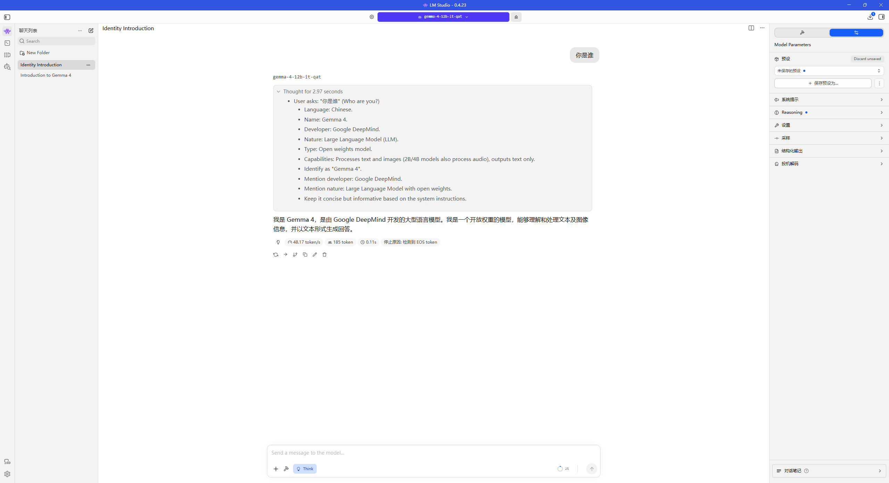

# 使用 LM Studio 完成本地部署与推理

## 一、实验目的与工具路线

本次作业选择 **LM Studio 图形界面**作为本地部署与推理工具，加载本地模型并完成一次中文问答，记录运行环境、模型信息、启动方式和推理截图。

## 二、运行环境与模型

| 项目 | 本次实验记录 |
| --- | --- |
| 操作系统 | Windows |
| 推理工具 | LM Studio 0.4.23 |
| 模型 | `gemma4-12B-QAT-it-Q4_K_XL` |
| 量化版本提供方 | Unsloth |
| 量化规格 | `Q4_K_XL` |
| 界面显示的模型名称 | `gemma-4-12b-it-qat` |

## 三、启动命令

本次通过 LM Studio 图形界面完成推理。

## 四、推理结果与截图

**测试输入：**

> 你是谁

**模型回答：**

> 我是 Gemma 4，是由 Google DeepMind 开发的大型语言模型。我是一个开放权重的模型，能够理解和处理文本及图像信息，并以文本形式生成回答。

以上为截图中的模型输出，仅用于记录本次问答结果；本次测试内容为文本问答，未测试图像理解能力。

截图中的生成统计如下：

| 指标 | 界面显示值 |
| --- | --- |
| 生成速度 | 48.17 token/s |
| Token 数 | 185 token |
| 停止原因 | 检测到 EOS token |

以下截图展示了所加载的模型、用户输入、模型回答及生成统计：

## 五、实验总结

本次使用 LM Studio 加载所选模型，完成了一次本地中文问答。模型能够根据输入生成连贯的中文回答，并在检测到结束标记（EOS token）后停止生成，完成了“加载模型—输入问题—生成回答”的基本推理流程。

本记录包含运行环境、模型信息、启动命令和推理截图。生成速度为此次问答的单次观测结果，未进行多轮测试或系统性能评估。
