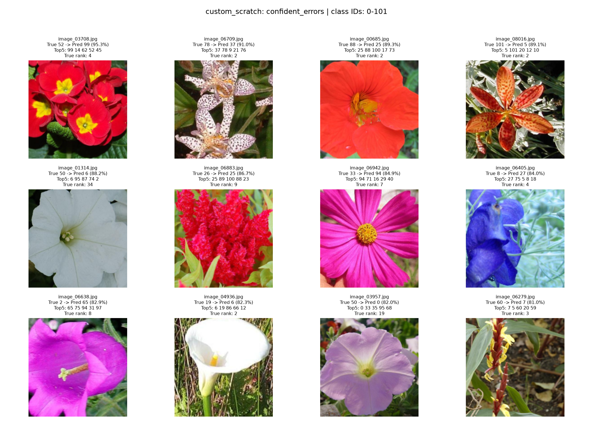
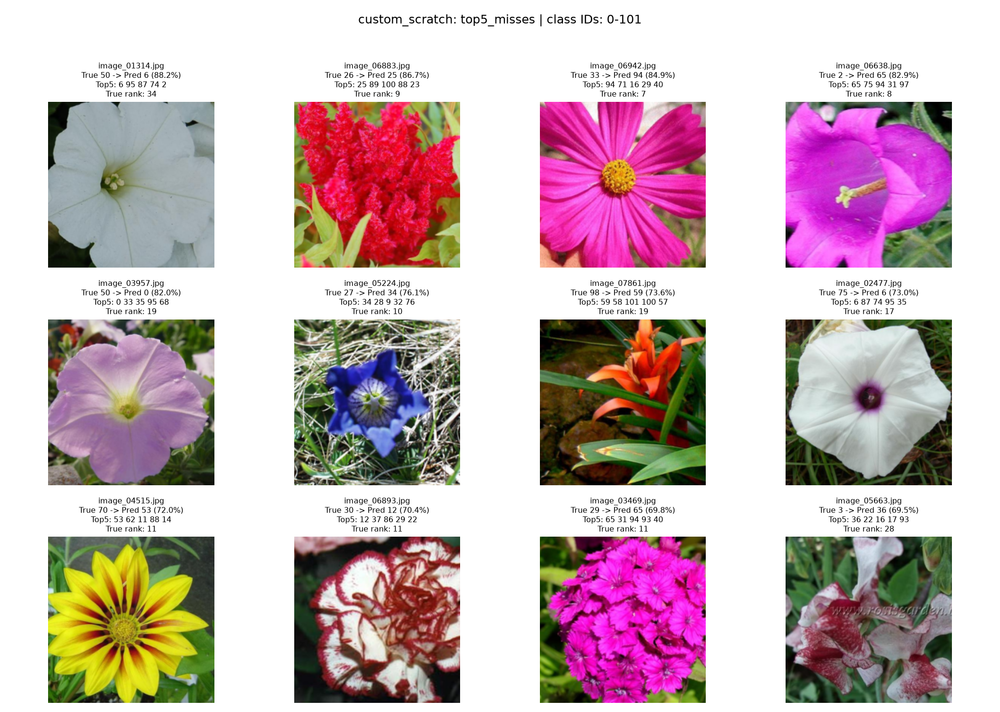
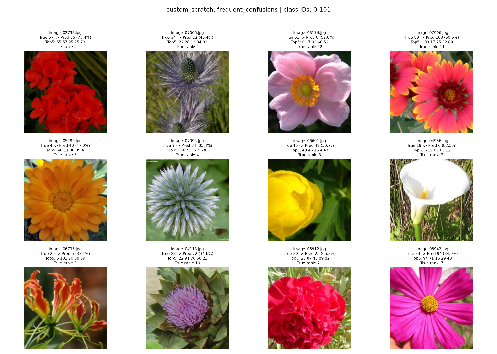
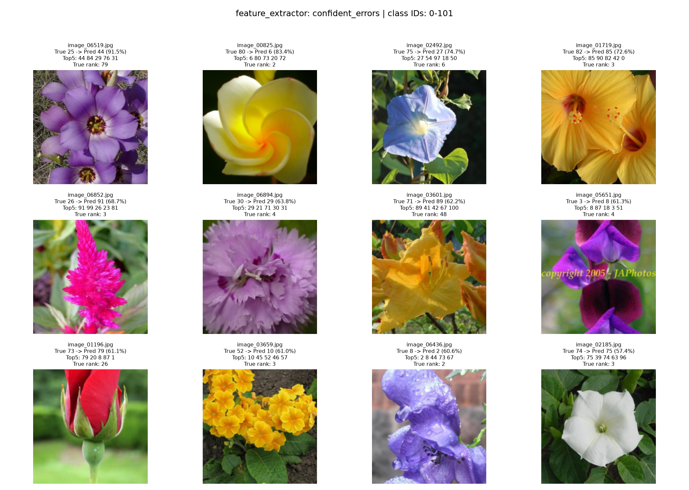
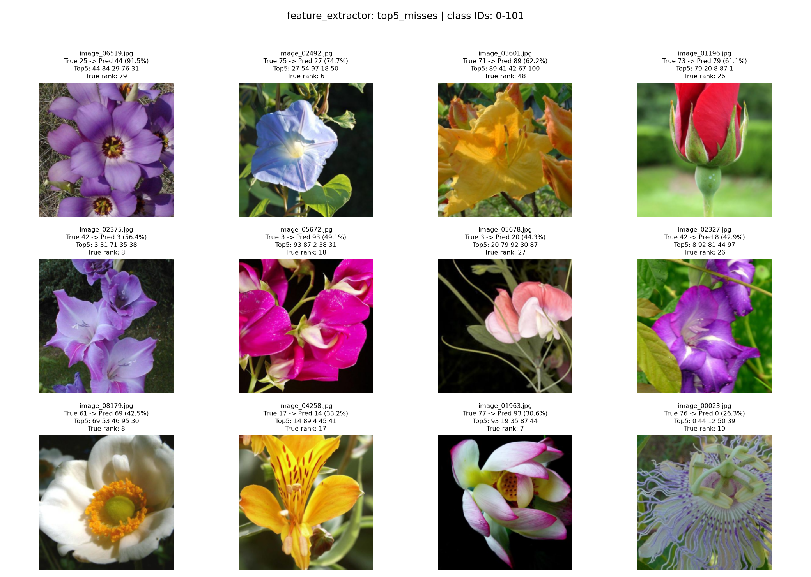
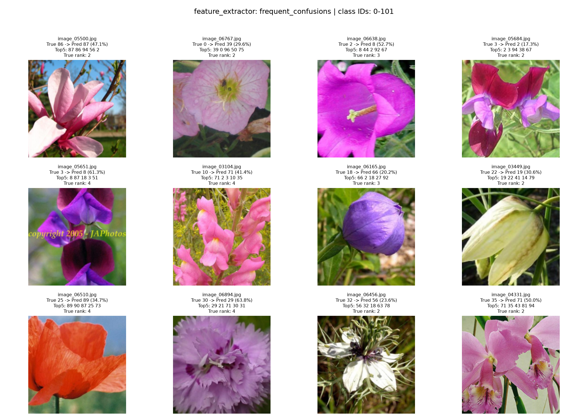
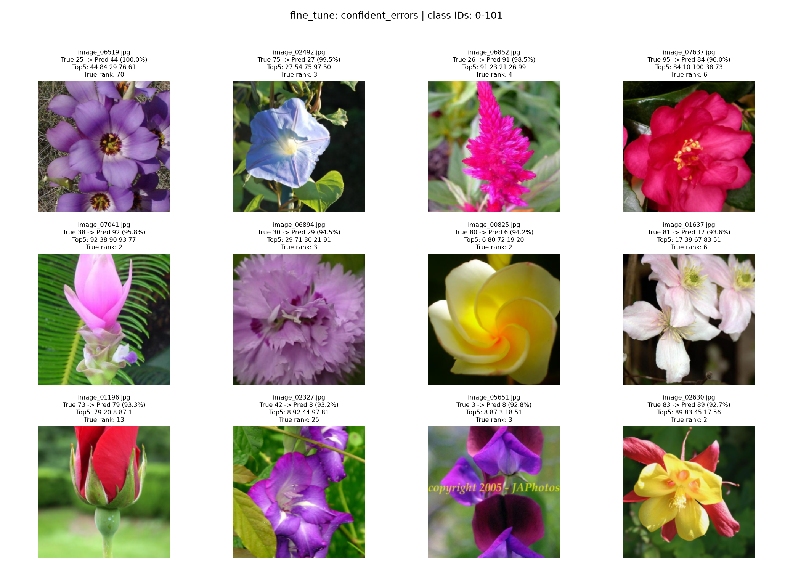
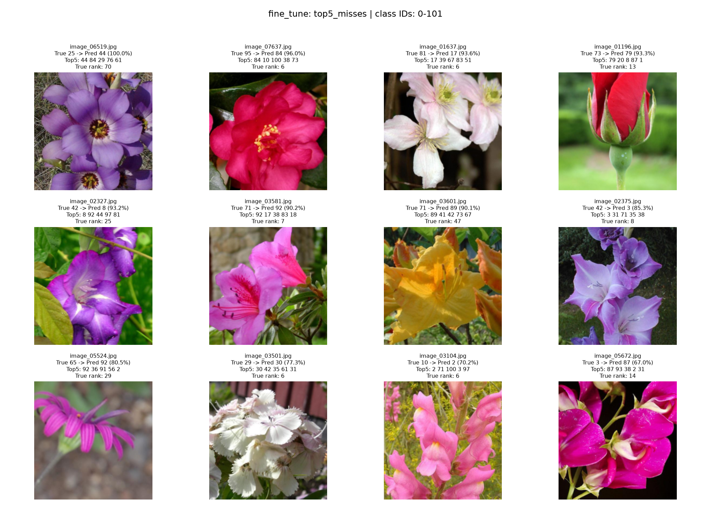
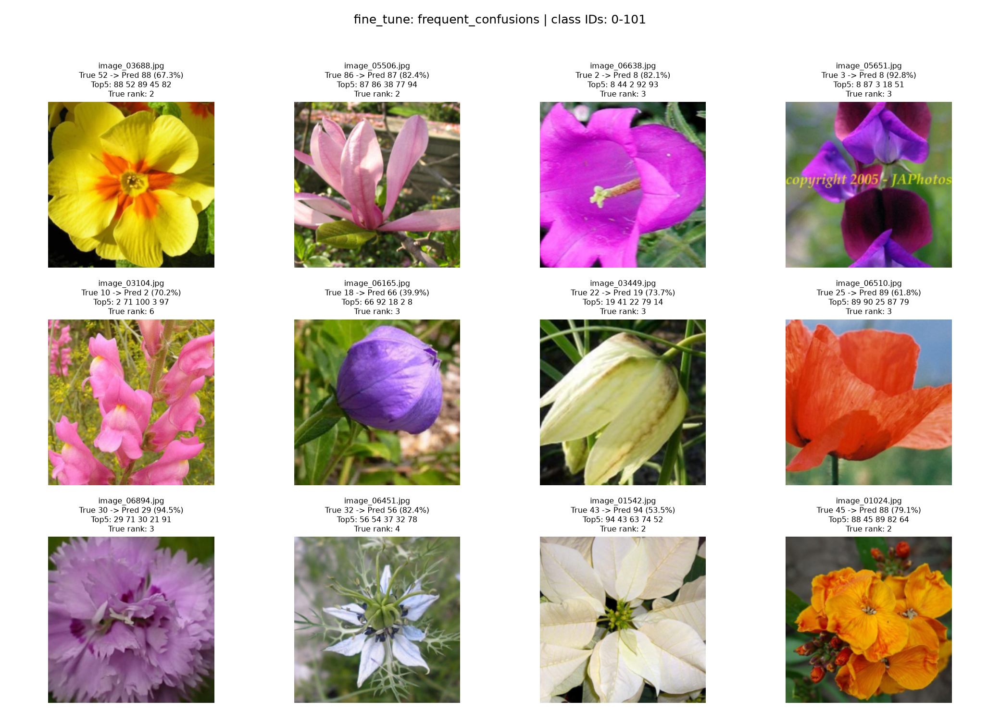

# Flowers102 验证集误分类分析

仅分析官方验证集；不使用测试集、不训练、不下载权重。类别 ID 为 0～101，Oxford 原始 ID 为 ID+1，未假定花名映射。

## 指标汇总

| 模型 | 样本 | 错误数 | Top-1 | Top-5 | Macro Precision | Macro Recall | Macro F1 |
| --- | ---: | ---: | ---: | ---: | ---: | ---: | ---: |
| custom_scratch | 1020 | 632 | 38.04% | 67.25% | 37.76% | 38.04% | 35.81% |
| feature_extractor | 1020 | 172 | 83.14% | 96.18% | 84.58% | 83.14% | 83.08% |
| fine_tune | 1020 | 155 | 84.80% | 96.47% | 86.31% | 84.80% | 84.61% |

微调相对冻结特征：修正 37 张错误，新增 20 张错误，净增加 17 张正确预测。

## 阅读说明

- 所有 CSV 指标保存为 0～1；每类指标在全验证集混淆矩阵上计算，分母为零时记为 0。
- 官方验证集每类仅 10 张，单张图片使该类 Recall 变化 10 个百分点；低分类别排名不宜过度解读。
- 混淆对为有向统计，A→B 与 B→A 分开；矩阵行为真实类别、列为预测类别。
- 图片是模型实际输入的中心裁剪视图；选择规则为高置信度错误、Top-5 未命中错误、高频混淆对各一例，各组可能重叠，不代表随机样本。
- 图中置信度为 softmax 分数，不代表已校准的正确概率。完整原图路径、Top-5 分数见 predictions.csv。
- summary.csv 为总体指标；每个模型目录包含 per_class_metrics.csv、confused_pairs.csv、confusion_matrix.csv、predictions.csv、selected_errors.csv；metadata.json 记录配置和权重 SHA256。

## custom_scratch

### 最低 F1 类别

| 类别 ID | 样本数 | Precision | Recall | F1 |
| --- | ---: | ---: | ---: | ---: |
| 2 | 10 | 0.00% | 0.00% | 0.00% |
| 10 | 10 | 0.00% | 0.00% | 0.00% |
| 15 | 10 | 0.00% | 0.00% | 0.00% |
| 30 | 10 | 0.00% | 0.00% | 0.00% |
| 32 | 10 | 0.00% | 0.00% | 0.00% |
| 79 | 10 | 0.00% | 0.00% | 0.00% |
| 83 | 10 | 0.00% | 0.00% | 0.00% |
| 89 | 10 | 0.00% | 0.00% | 0.00% |
| 92 | 10 | 0.00% | 0.00% | 0.00% |
| 87 | 10 | 7.14% | 10.00% | 8.33% |

### 高频有向混淆对

| 真实 ID → 预测 ID | 数量 | 占真实类别比例 |
| --- | ---: | ---: |
| 57 → 55 | 5 | 50% |
| 34 → 22 | 4 | 40% |
| 61 → 0 | 4 | 40% |
| 99 → 100 | 4 | 40% |
| 4 → 40 | 3 | 30% |
| 9 → 34 | 3 | 30% |
| 15 → 49 | 3 | 30% |
| 19 → 6 | 3 | 30% |
| 20 → 5 | 3 | 30% |
| 28 → 22 | 3 | 30% |

### 高置信度错误

### Top-5 未命中

### 高频混淆对样例

## feature_extractor

### 最低 F1 类别

| 类别 ID | 样本数 | Precision | Recall | F1 |
| --- | ---: | ---: | ---: | ---: |
| 3 | 10 | 36.36% | 40.00% | 38.10% |
| 95 | 10 | 44.44% | 40.00% | 42.11% |
| 10 | 10 | 50.00% | 40.00% | 44.44% |
| 2 | 10 | 41.67% | 50.00% | 45.45% |
| 89 | 10 | 42.86% | 60.00% | 50.00% |
| 39 | 10 | 50.00% | 60.00% | 54.55% |
| 42 | 10 | 62.50% | 50.00% | 55.56% |
| 71 | 10 | 50.00% | 70.00% | 58.33% |
| 83 | 10 | 83.33% | 50.00% | 62.50% |
| 66 | 10 | 66.67% | 60.00% | 63.16% |

### 高频有向混淆对

| 真实 ID → 预测 ID | 数量 | 占真实类别比例 |
| --- | ---: | ---: |
| 86 → 87 | 3 | 30% |
| 0 → 39 | 2 | 20% |
| 2 → 8 | 2 | 20% |
| 3 → 2 | 2 | 20% |
| 3 → 8 | 2 | 20% |
| 10 → 71 | 2 | 20% |
| 18 → 66 | 2 | 20% |
| 22 → 19 | 2 | 20% |
| 25 → 89 | 2 | 20% |
| 30 → 29 | 2 | 20% |

### 高置信度错误

### Top-5 未命中

### 高频混淆对样例

## fine_tune

### 最低 F1 类别

| 类别 ID | 样本数 | Precision | Recall | F1 |
| --- | ---: | ---: | ---: | ---: |
| 52 | 10 | 75.00% | 30.00% | 42.86% |
| 3 | 10 | 57.14% | 40.00% | 47.06% |
| 95 | 10 | 57.14% | 40.00% | 47.06% |
| 89 | 10 | 41.18% | 70.00% | 51.85% |
| 10 | 10 | 55.56% | 50.00% | 52.63% |
| 42 | 10 | 71.43% | 50.00% | 58.82% |
| 2 | 10 | 53.85% | 70.00% | 60.87% |
| 30 | 10 | 83.33% | 50.00% | 62.50% |
| 32 | 10 | 100.00% | 50.00% | 66.67% |
| 44 | 10 | 57.14% | 80.00% | 66.67% |

### 高频有向混淆对

| 真实 ID → 预测 ID | 数量 | 占真实类别比例 |
| --- | ---: | ---: |
| 52 → 88 | 3 | 30% |
| 86 → 87 | 3 | 30% |
| 2 → 8 | 2 | 20% |
| 3 → 8 | 2 | 20% |
| 10 → 2 | 2 | 20% |
| 18 → 66 | 2 | 20% |
| 22 → 19 | 2 | 20% |
| 25 → 89 | 2 | 20% |
| 30 → 29 | 2 | 20% |
| 32 → 56 | 2 | 20% |

### 高置信度错误

### Top-5 未命中

### 高频混淆对样例

