# Flowers102 验证集误分类分析

仅分析官方验证集；不使用测试集、不训练、不下载权重。类别 ID 为 0～101，Oxford 原始 ID 为 ID+1，未假定花名映射。

## 指标汇总

| 模型 | 样本 | 错误数 | Top-1 | Top-5 | Macro Precision | Macro Recall | Macro F1 |
|---|---:|---:|---:|---:|---:|---:|---:|
| custom_scratch | 1020 | 686 | 32.75% | 60.29% | 31.91% | 32.75% | 30.90% |
| feature_extractor | 1020 | 171 | 83.24% | 95.59% | 84.66% | 83.24% | 83.13% |
| fine_tune | 1020 | 151 | 85.20% | 96.86% | 86.56% | 85.20% | 85.03% |
| feature_extractor_aug | 1020 | 177 | 82.65% | 95.39% | 84.17% | 82.65% | 82.58% |
| fine_tune_aug | 1020 | 157 | 84.61% | 96.67% | 86.16% | 84.61% | 84.46% |

微调相对冻结特征：修正 44 张错误，新增 24 张错误，净增加 20 张正确预测。

## 阅读说明

- 所有 CSV 指标保存为 0～1；每类指标在全验证集混淆矩阵上计算，分母为零时记为 0。
- 官方验证集每类仅 10 张，单张图片使该类 Recall 变化 10 个百分点；低分类别排名不宜过度解读。
- 混淆对为有向统计，A→B 与 B→A 分开；矩阵行为真实类别、列为预测类别。
- 图片是模型实际输入的中心裁剪视图；选择规则为高置信度错误、Top-5 未命中错误、高频混淆对各一例，各组可能重叠，不代表随机样本。
- 图中置信度为 softmax 分数，不代表已校准的正确概率。完整原图路径、Top-5 分数见 predictions.csv。
- summary.csv 为总体指标；每个模型目录包含 per_class_metrics.csv、confused_pairs.csv、confusion_matrix.csv、predictions.csv、selected_errors.csv；metadata.json 记录配置和权重 SHA256。

## 模型逐图对照

前模型→后模型：修正=错→对，新增错误=对→错；净收益=修正−新增。
增强微调继承增强 FC，故微调增强对比反映整条训练流程的变化。

| 对照 | 前模型 → 后模型 | 修正 | 新增错误 | 都正确 | 都错误 | 净收益 |
|---|---|---:|---:|---:|---:|---:|
| baseline_finetuning | feature_extractor → fine_tune | 44 | 24 | 825 | 127 | +20 |
| augmented_finetuning | feature_extractor_aug → fine_tune_aug | 44 | 24 | 819 | 133 | +20 |
| fc_augmentation | feature_extractor → feature_extractor_aug | 6 | 12 | 837 | 165 | -6 |
| finetune_augmentation | fine_tune → fine_tune_aug | 5 | 11 | 858 | 146 | -6 |

逐图明细、修正/新增错误清单和逐类净变化见 comparisons/ 对应子目录。
图片为确定性挑选：修正组按前模型错误置信度降序，新增组按后模型错误置信度降序；不代表随机样本。

### feature_extractor → fine_tune

**修正的错误**

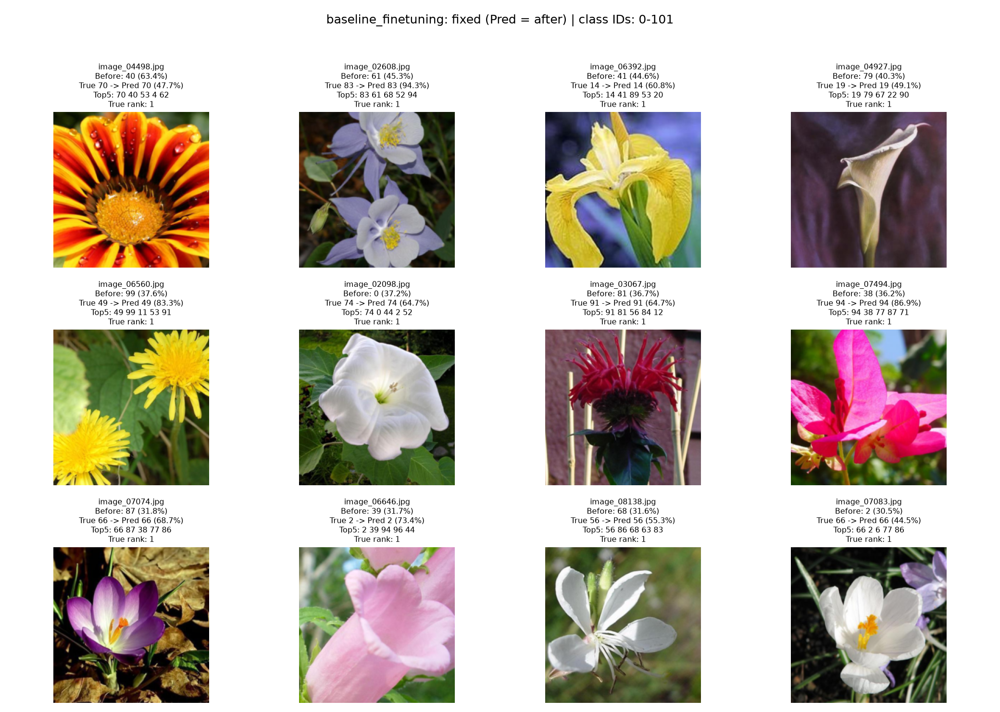

**新增的错误**

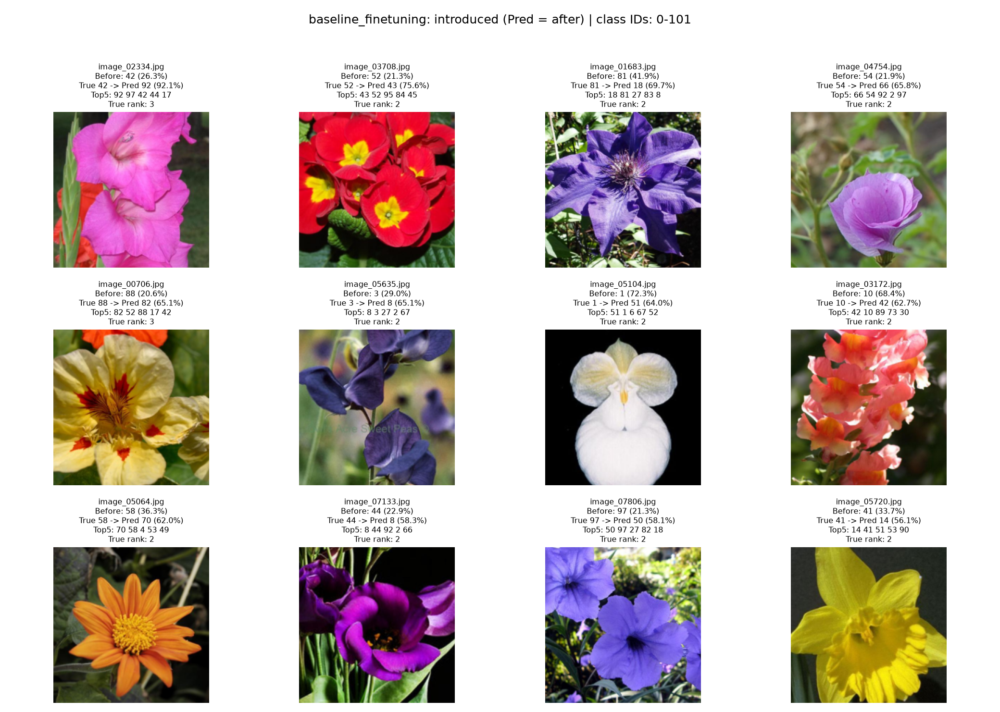

### feature_extractor_aug → fine_tune_aug

**修正的错误**

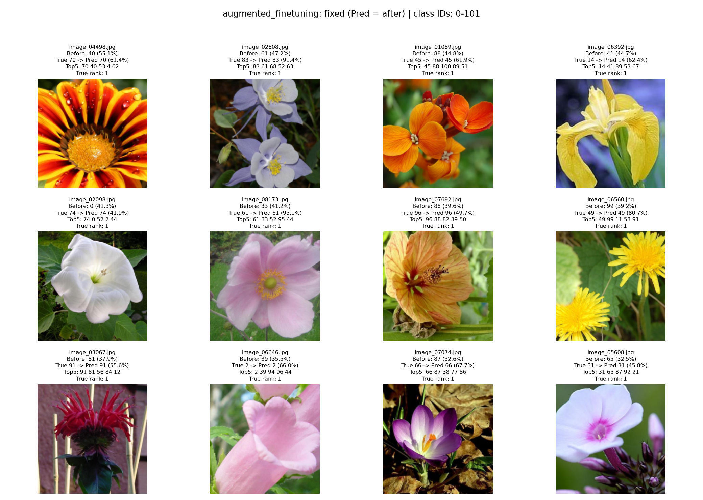

**新增的错误**

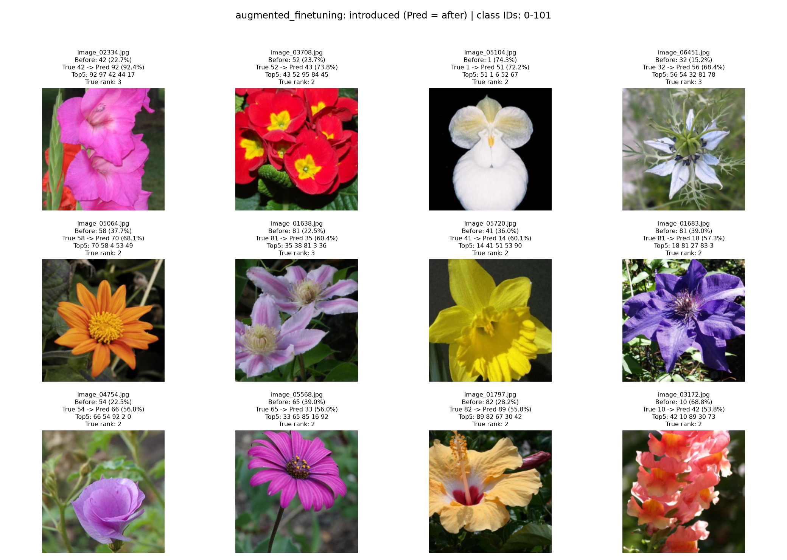

### feature_extractor → feature_extractor_aug

**修正的错误**

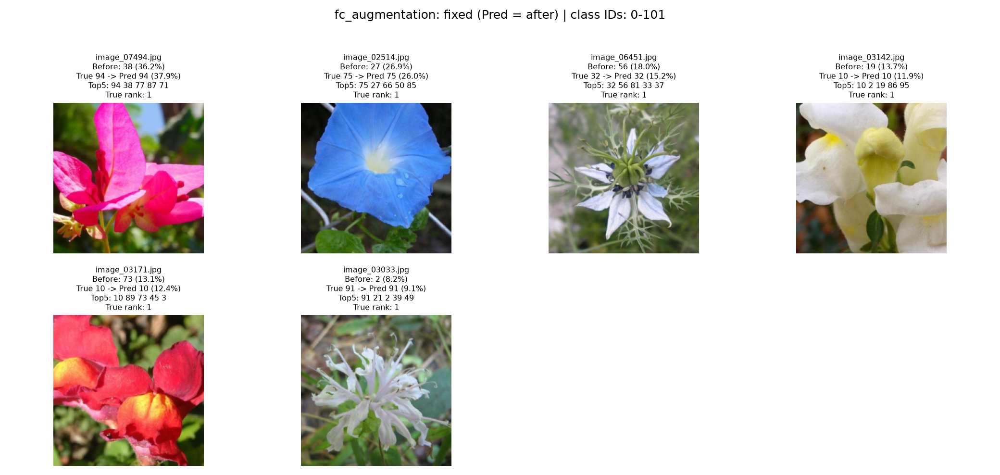

**新增的错误**

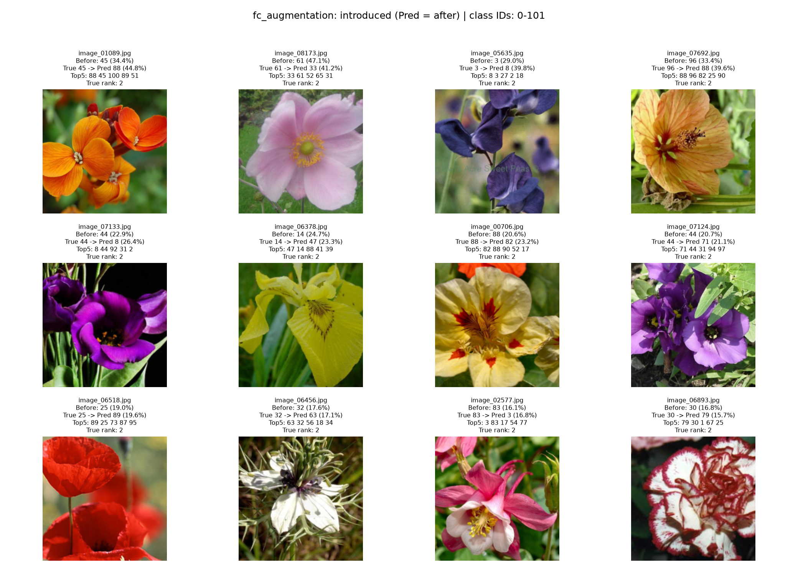

### fine_tune → fine_tune_aug

**修正的错误**

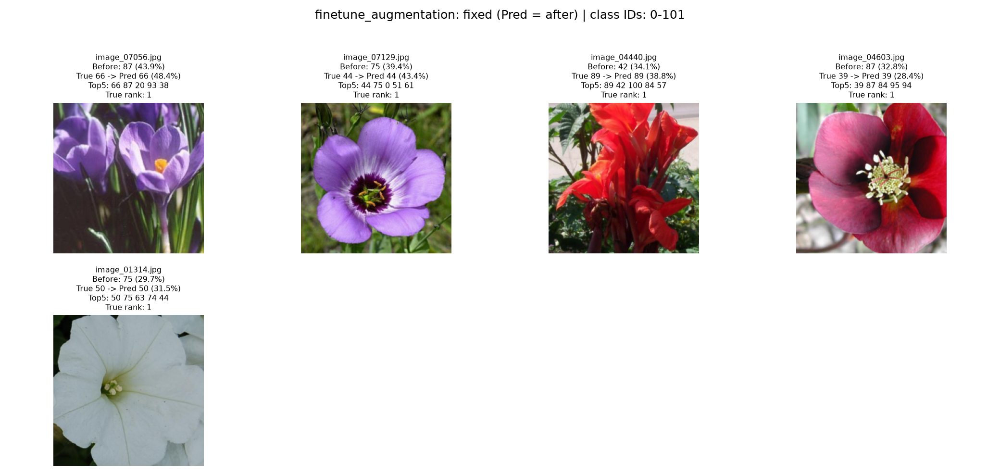

**新增的错误**

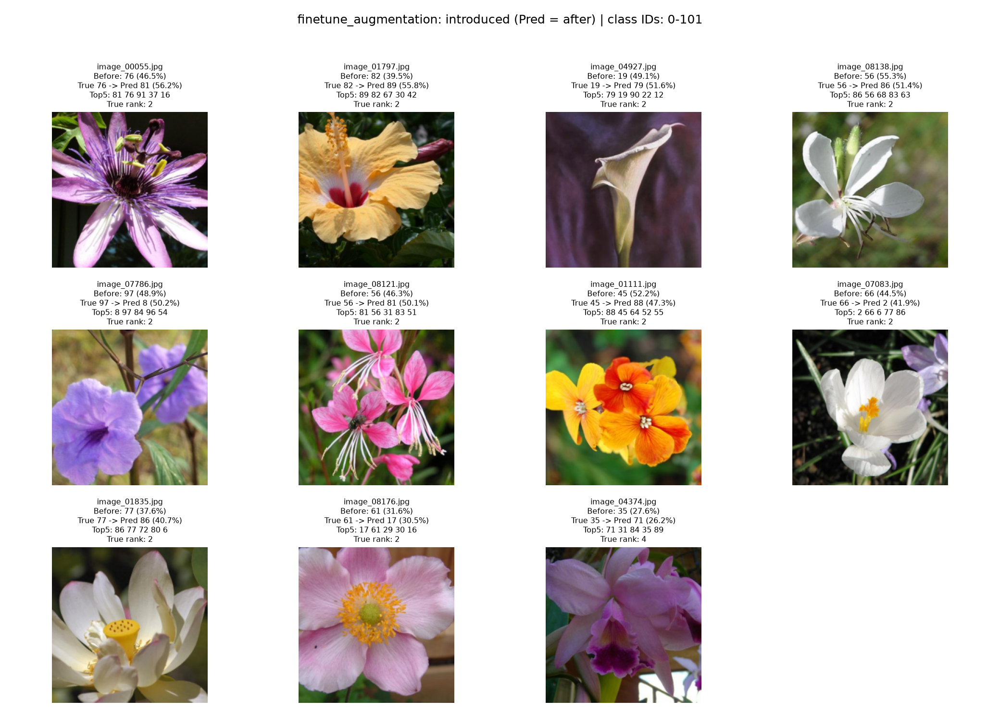

## custom_scratch

### 最低 F1 类别

| 类别 ID | 样本数 | Precision | Recall | F1 |
|---|---:|---:|---:|---:|
| 3 | 10 | 0.00% | 0.00% | 0.00% |
| 10 | 10 | 0.00% | 0.00% | 0.00% |
| 15 | 10 | 0.00% | 0.00% | 0.00% |
| 30 | 10 | 0.00% | 0.00% | 0.00% |
| 33 | 10 | 0.00% | 0.00% | 0.00% |
| 42 | 10 | 0.00% | 0.00% | 0.00% |
| 52 | 10 | 0.00% | 0.00% | 0.00% |
| 69 | 10 | 0.00% | 0.00% | 0.00% |
| 72 | 10 | 0.00% | 0.00% | 0.00% |
| 78 | 10 | 0.00% | 0.00% | 0.00% |

### 高频有向混淆对

| 真实 ID → 预测 ID | 数量 | 占真实类别比例 |
|---|---:|---:|
| 74 → 19 | 5 | 50% |
| 9 → 34 | 4 | 40% |
| 15 → 47 | 4 | 40% |
| 33 → 71 | 4 | 40% |
| 37 → 34 | 4 | 40% |
| 69 → 48 | 4 | 40% |
| 85 → 29 | 4 | 40% |
| 2 → 33 | 3 | 30% |
| 4 → 40 | 3 | 30% |
| 5 → 42 | 3 | 30% |

### 高置信度错误

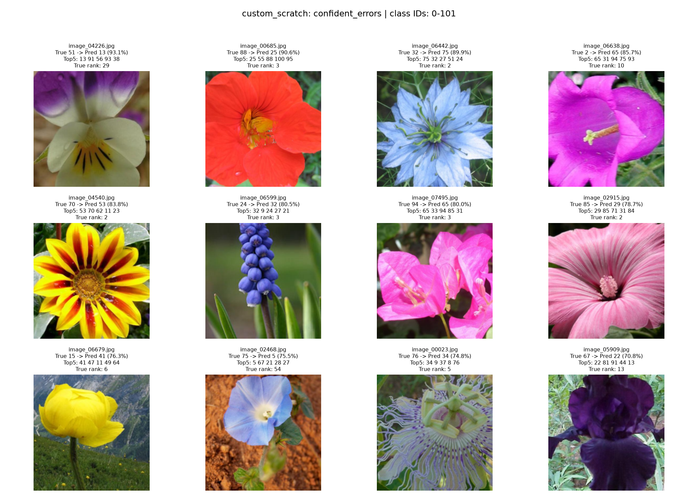

### Top-5 未命中

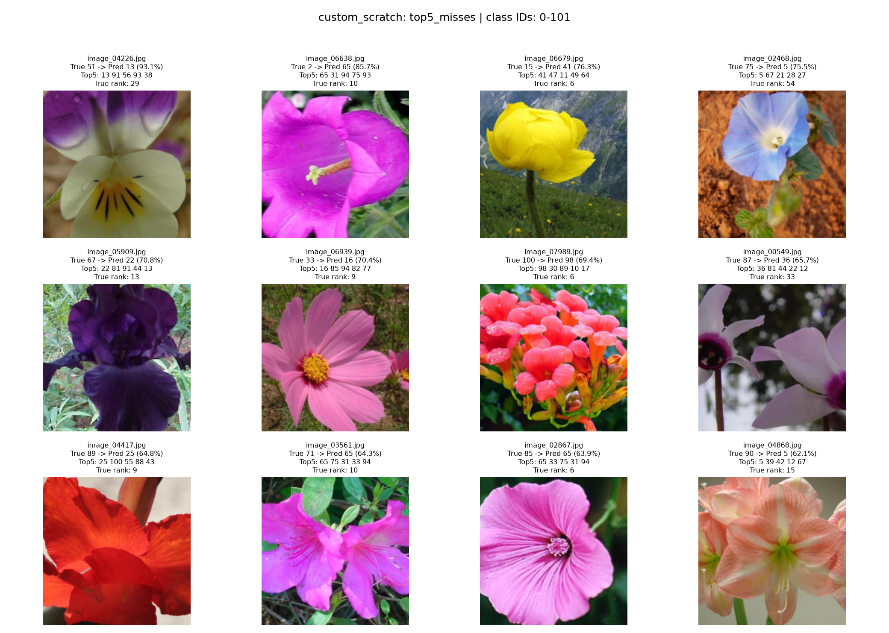

### 高频混淆对样例

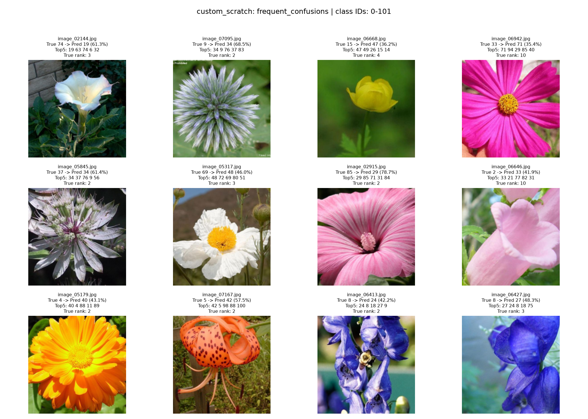

## feature_extractor

### 最低 F1 类别

| 类别 ID | 样本数 | Precision | Recall | F1 |
|---|---:|---:|---:|---:|
| 95 | 10 | 44.44% | 40.00% | 42.11% |
| 2 | 10 | 38.46% | 50.00% | 43.48% |
| 10 | 10 | 50.00% | 40.00% | 44.44% |
| 39 | 10 | 50.00% | 50.00% | 50.00% |
| 71 | 10 | 50.00% | 60.00% | 54.55% |
| 89 | 10 | 50.00% | 60.00% | 54.55% |
| 3 | 10 | 54.55% | 60.00% | 57.14% |
| 31 | 10 | 71.43% | 50.00% | 58.82% |
| 66 | 10 | 71.43% | 50.00% | 58.82% |
| 75 | 10 | 71.43% | 50.00% | 58.82% |

### 高频有向混淆对

| 真实 ID → 预测 ID | 数量 | 占真实类别比例 |
|---|---:|---:|
| 75 → 27 | 3 | 30% |
| 86 → 87 | 3 | 30% |
| 0 → 39 | 2 | 20% |
| 2 → 8 | 2 | 20% |
| 10 → 71 | 2 | 20% |
| 22 → 19 | 2 | 20% |
| 22 → 39 | 2 | 20% |
| 30 → 29 | 2 | 20% |
| 35 → 71 | 2 | 20% |
| 39 → 44 | 2 | 20% |

### 高置信度错误

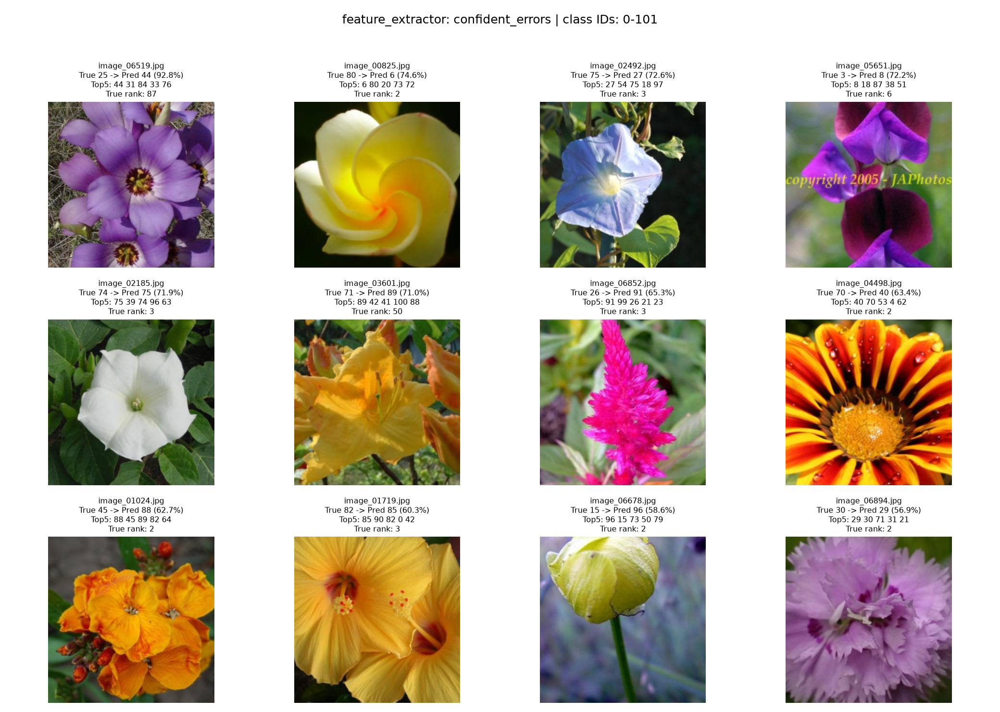

### Top-5 未命中

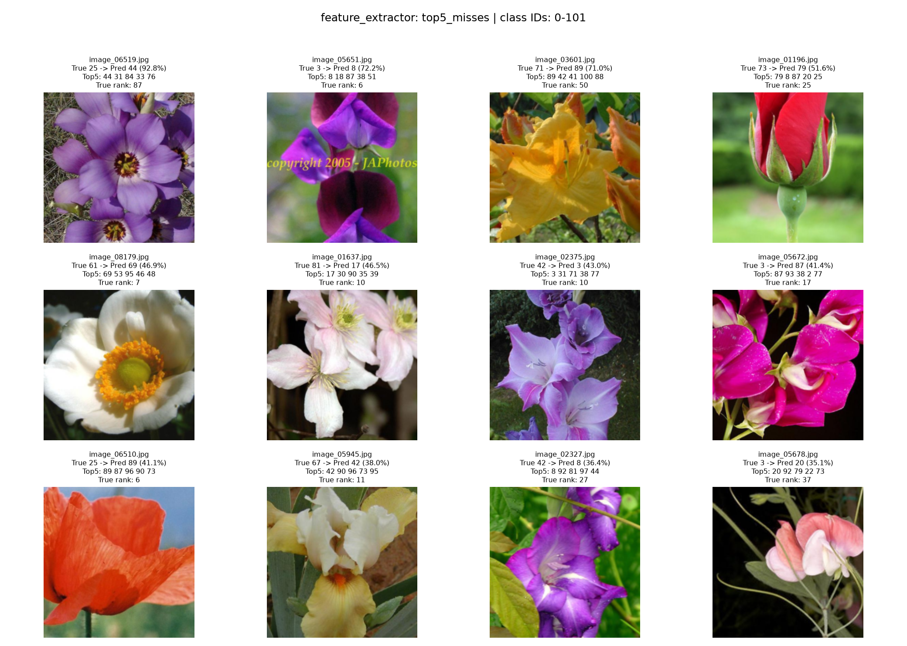

### 高频混淆对样例

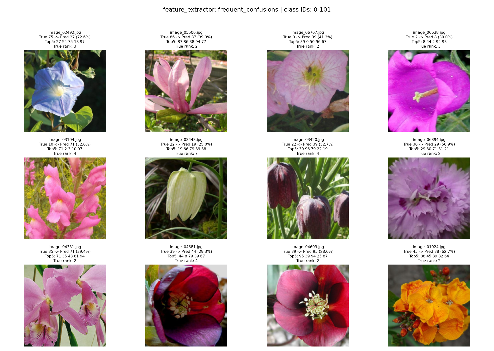

## fine_tune

### 最低 F1 类别

| 类别 ID | 样本数 | Precision | Recall | F1 |
|---|---:|---:|---:|---:|
| 95 | 10 | 50.00% | 30.00% | 37.50% |
| 52 | 10 | 75.00% | 30.00% | 42.86% |
| 3 | 10 | 57.14% | 40.00% | 47.06% |
| 89 | 10 | 40.00% | 60.00% | 48.00% |
| 10 | 10 | 50.00% | 50.00% | 50.00% |
| 42 | 10 | 55.56% | 50.00% | 52.63% |
| 44 | 10 | 53.85% | 70.00% | 60.87% |
| 75 | 10 | 66.67% | 60.00% | 63.16% |
| 2 | 10 | 58.33% | 70.00% | 63.64% |
| 32 | 10 | 100.00% | 50.00% | 66.67% |

### 高频有向混淆对

| 真实 ID → 预测 ID | 数量 | 占真实类别比例 |
|---|---:|---:|
| 2 → 8 | 2 | 20% |
| 3 → 8 | 2 | 20% |
| 3 → 87 | 2 | 20% |
| 10 → 44 | 2 | 20% |
| 18 → 66 | 2 | 20% |
| 22 → 19 | 2 | 20% |
| 29 → 30 | 2 | 20% |
| 30 → 29 | 2 | 20% |
| 32 → 56 | 2 | 20% |
| 41 → 14 | 2 | 20% |

### 高置信度错误

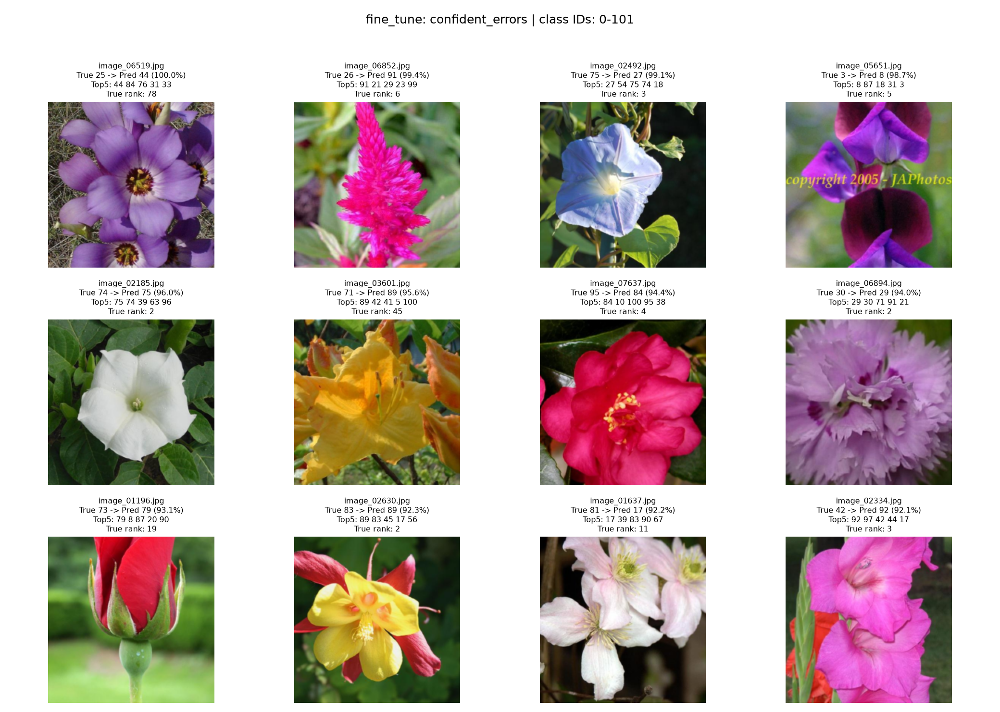

### Top-5 未命中

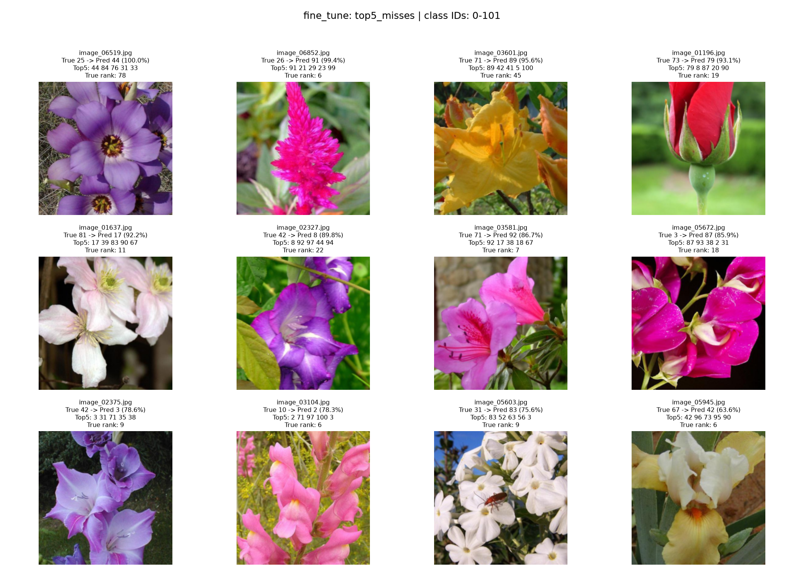

### 高频混淆对样例

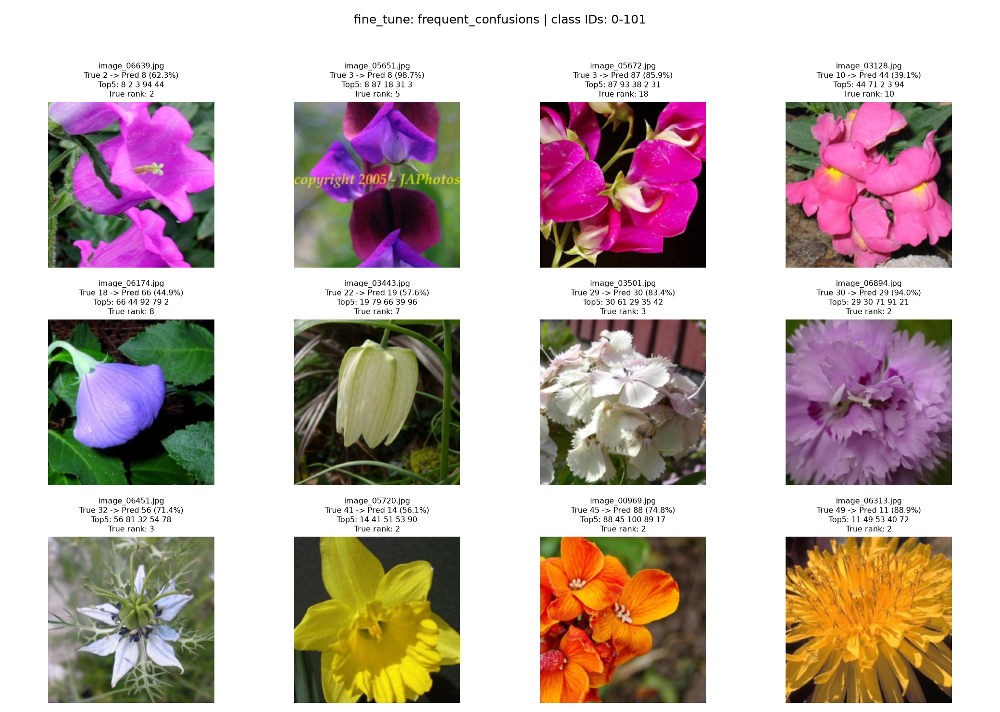

## feature_extractor_aug

### 最低 F1 类别

| 类别 ID | 样本数 | Precision | Recall | F1 |
|---|---:|---:|---:|---:|
| 95 | 10 | 44.44% | 40.00% | 42.11% |
| 2 | 10 | 45.45% | 50.00% | 47.62% |
| 3 | 10 | 45.45% | 50.00% | 47.62% |
| 39 | 10 | 50.00% | 50.00% | 50.00% |
| 89 | 10 | 42.86% | 60.00% | 50.00% |
| 71 | 10 | 50.00% | 60.00% | 54.55% |
| 31 | 10 | 62.50% | 50.00% | 55.56% |
| 66 | 10 | 62.50% | 50.00% | 55.56% |
| 10 | 10 | 60.00% | 60.00% | 60.00% |
| 61 | 10 | 60.00% | 60.00% | 60.00% |

### 高频有向混淆对

| 真实 ID → 预测 ID | 数量 | 占真实类别比例 |
|---|---:|---:|
| 45 → 88 | 3 | 30% |
| 86 → 87 | 3 | 30% |
| 0 → 39 | 2 | 20% |
| 2 → 8 | 2 | 20% |
| 3 → 8 | 2 | 20% |
| 10 → 71 | 2 | 20% |
| 18 → 66 | 2 | 20% |
| 22 → 39 | 2 | 20% |
| 25 → 89 | 2 | 20% |
| 30 → 29 | 2 | 20% |

### 高置信度错误

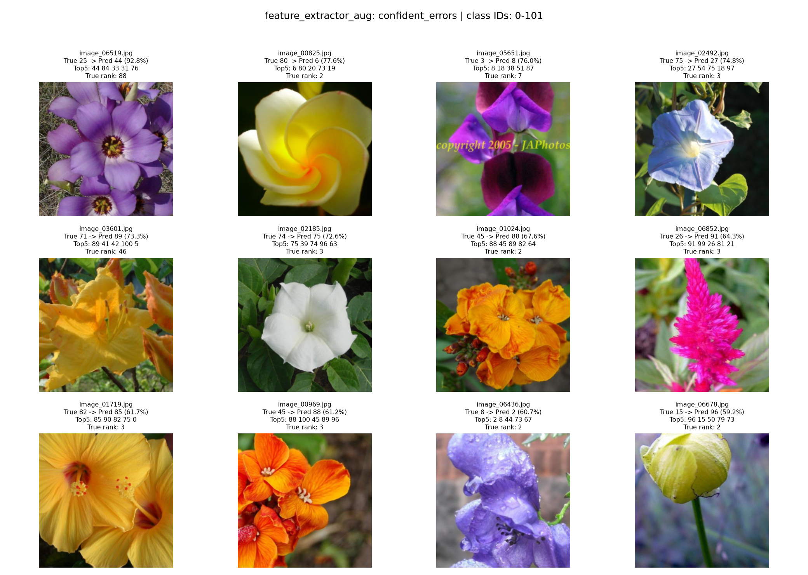

### Top-5 未命中

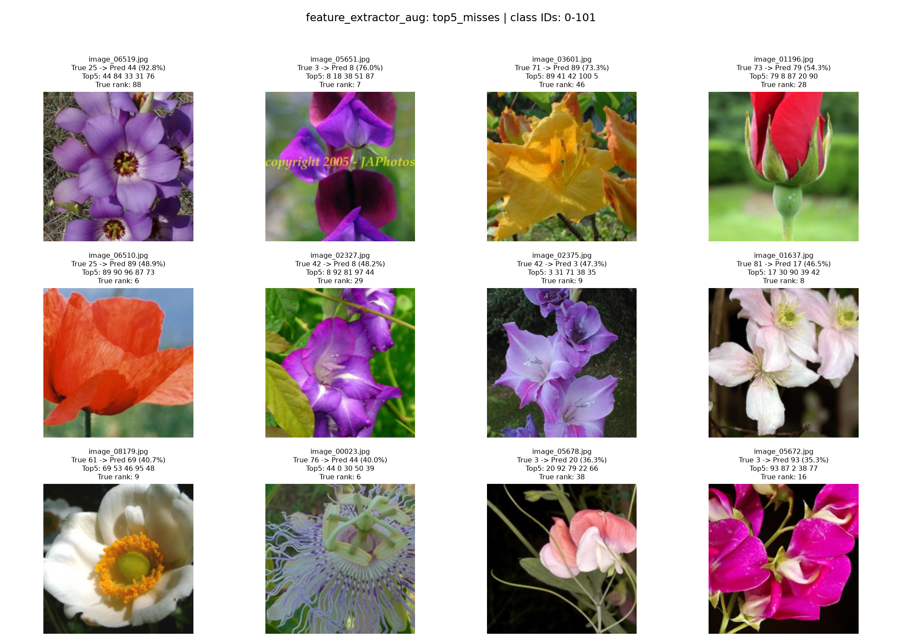

### 高频混淆对样例

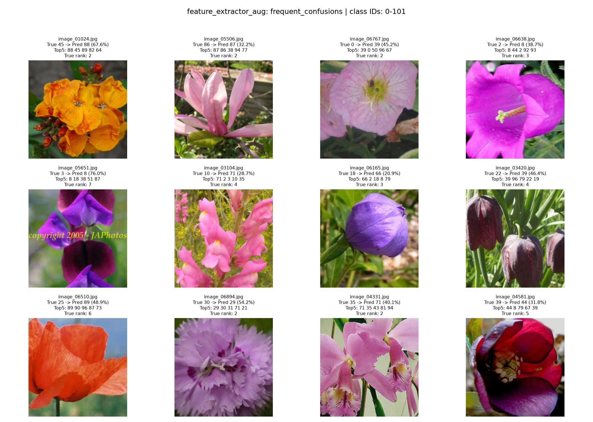

## fine_tune_aug

### 最低 F1 类别

| 类别 ID | 样本数 | Precision | Recall | F1 |
|---|---:|---:|---:|---:|
| 95 | 10 | 50.00% | 30.00% | 37.50% |
| 52 | 10 | 75.00% | 30.00% | 42.86% |
| 3 | 10 | 57.14% | 40.00% | 47.06% |
| 10 | 10 | 50.00% | 50.00% | 50.00% |
| 89 | 10 | 41.18% | 70.00% | 51.85% |
| 42 | 10 | 62.50% | 50.00% | 55.56% |
| 2 | 10 | 53.85% | 70.00% | 60.87% |
| 88 | 10 | 53.33% | 80.00% | 64.00% |
| 8 | 10 | 52.94% | 90.00% | 66.67% |
| 32 | 10 | 100.00% | 50.00% | 66.67% |

### 高频有向混淆对

| 真实 ID → 预测 ID | 数量 | 占真实类别比例 |
|---|---:|---:|
| 45 → 88 | 3 | 30% |
| 52 → 88 | 3 | 30% |
| 2 → 8 | 2 | 20% |
| 3 → 8 | 2 | 20% |
| 18 → 66 | 2 | 20% |
| 22 → 19 | 2 | 20% |
| 29 → 30 | 2 | 20% |
| 30 → 29 | 2 | 20% |
| 32 → 56 | 2 | 20% |
| 35 → 71 | 2 | 20% |

### 高置信度错误

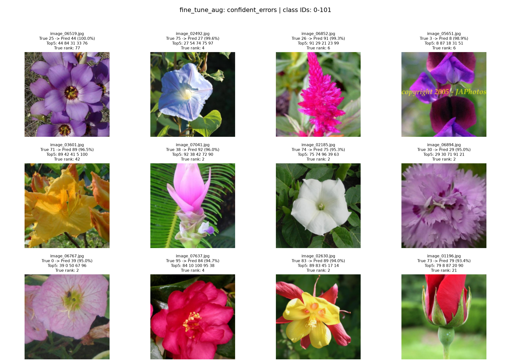

### Top-5 未命中

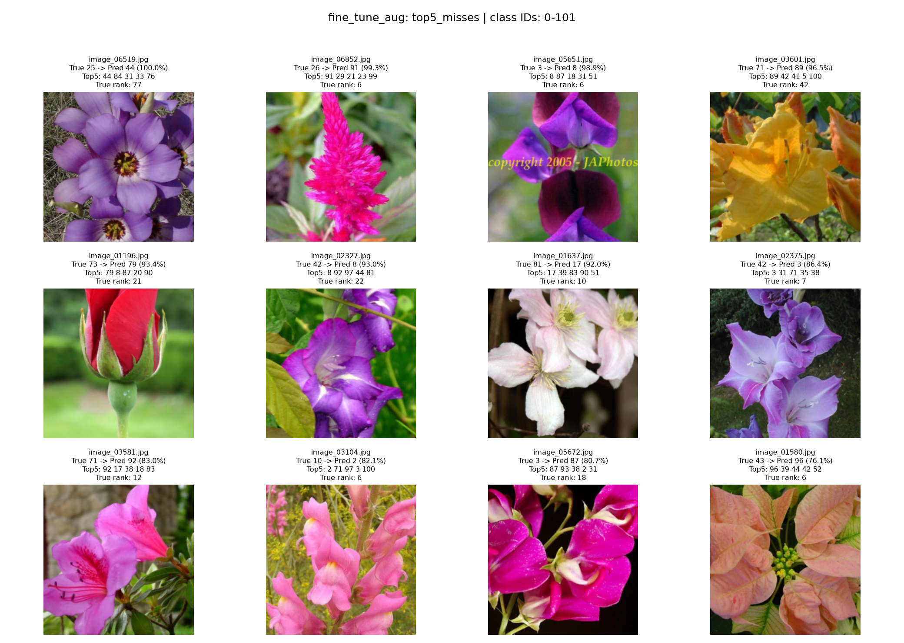

### 高频混淆对样例

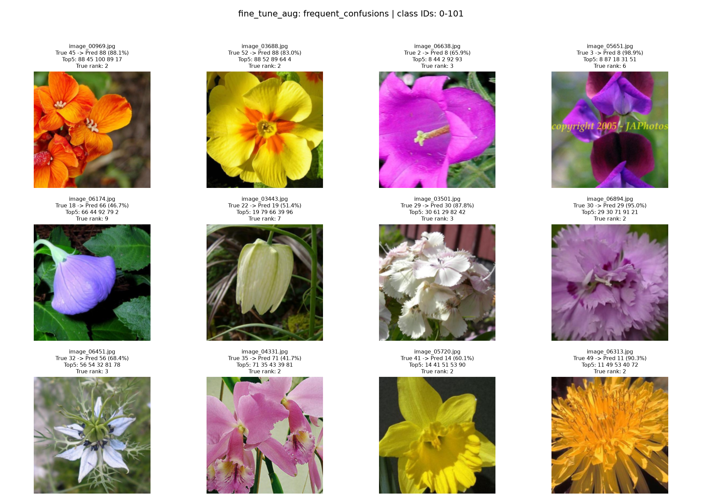
