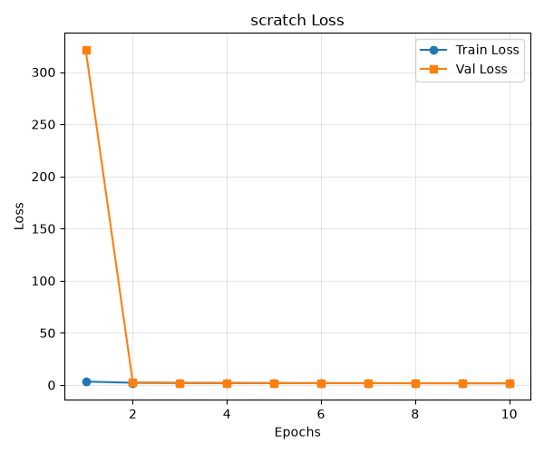
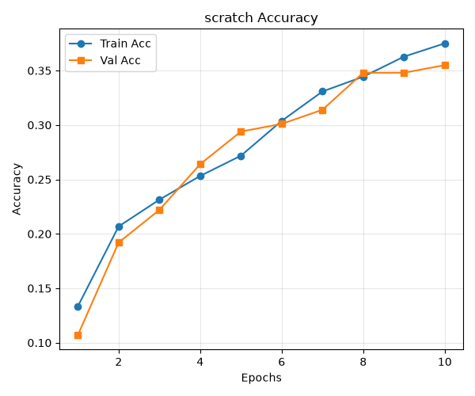
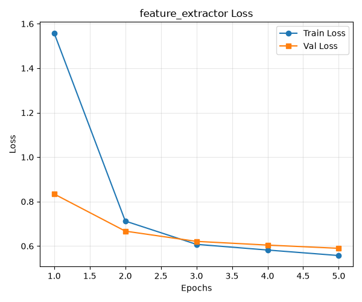
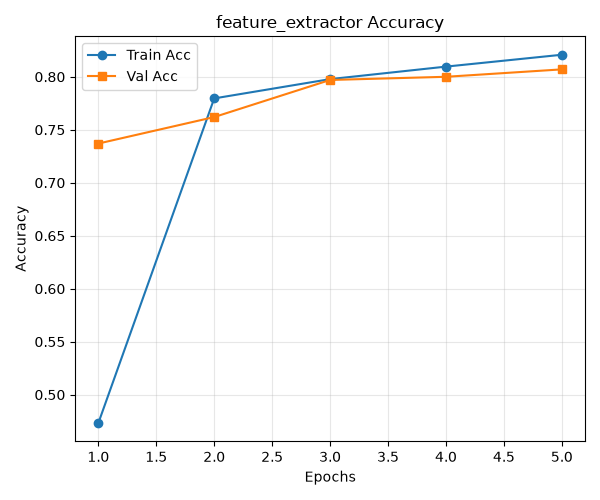
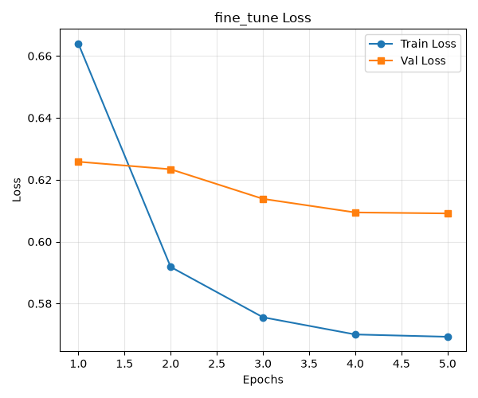
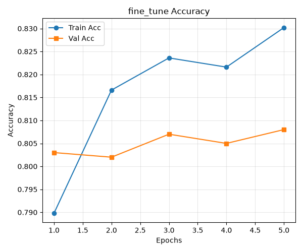

# Week 6 迁移学习实验结果

## 实验目的

本实验在 CIFAR-10 小规模数据集上比较三种 ResNet18 训练方式：

1. 随机初始化全部参数并从头训练。
2. 加载 ImageNet 预训练权重，冻结卷积主干，只训练分类层 `fc`。
3. 在第二阶段最佳模型的基础上，解冻 `layer4` 和 `fc` 进行微调。

实验用于观察小数据条件下，ImageNet 预训练特征能否提高模型的
收敛速度和分类性能，以及进一步微调是否能够继续改善结果。

## 实验设置

| 项目 | 设置 |
| :--- | :--- |
| 数据集 | CIFAR-10 |
| 训练集 | 5,000张 |
| 验证集 | 1,000张 |
| 测试集 | 1,000张 |
| 数据划分种子 | 42 |
| 输入尺寸 | `3 × 224 × 224` |
| 模型 | torchvision ResNet18 |
| 预训练权重 | ImageNet-1K |
| 损失函数 | `CrossEntropyLoss` |
| 优化器 | SGD，`momentum=0.9` |
| 批量大小 | 256 |

训练集使用随机裁剪和水平翻转进行数据增强。验证集和测试集使用
固定的缩放、中心裁剪以及 ImageNet 均值和标准差进行归一化。

三组实验的具体训练策略如下：

| 实验 | 初始化 | 训练范围 | 训练轮数 | 学习率 |
| :--- | :--- | :--- | ---: | :--- |
| `scratch` | 随机初始化 | 全部参数 | 10 | 0.1 |
| `feature_extractor` | ImageNet预训练 | 仅`fc` | 5 | 0.01 |
| `fine_tune` | 继承上一阶段最佳权重 | `layer4`和`fc` | 5 | `layer4=1e-4`，`fc=1e-3` |

每个阶段均根据验证集准确率保存最佳模型，并在恢复最佳权重后计算
测试集指标。三个阶段均使用余弦退火调整学习率。

## 实验结果

| 实验 | 最佳轮次 | 最佳训练准确率 | 最佳验证准确率 | 验证损失 | 测试准确率 | 测试损失 |
| :--- | ---: | ---: | ---: | ---: | ---: | ---: |
| `scratch` | 10 | 37.50% | 35.50% | 1.6637 | 39.00% | 1.6553 |
| `feature_extractor` | 5 | 82.08% | 80.70% | **0.5898** | **80.90%** | **0.5660** |
| `fine_tune` | 5 | 83.02% | **80.80%** | 0.6091 | 80.80% | 0.5863 |

## 结果分析

### 预训练特征的效果

随机初始化模型训练10轮后的测试准确率为39.00%，而加载 ImageNet
预训练权重并仅训练分类层5轮后，测试准确率达到80.90%，提高了
41.90个百分点。

这说明预训练主干已经学习到边缘、纹理和形状等通用视觉特征。
在只有5,000张训练图片时，新分类层可以直接利用这些特征完成
CIFAR-10 分类，因此比从头学习全部卷积参数收敛得更快。

随机初始化模型到第10轮时训练和验证准确率仍在上升，说明该模型
尚未充分收敛。因此，41.90个百分点主要体现预训练模型在有限数据
和有限训练轮数下的收敛速度与样本效率优势，而不能视为两种方法
充分训练后的最终性能差距。

### 特征提取器的泛化表现

`feature_extractor` 的训练准确率为82.08%，验证准确率为80.70%，
两者相差1.38个百分点；测试准确率为80.90%，与验证准确率只相差
0.20个百分点。训练损失和验证损失均持续下降，没有出现明显过拟合。

这组实验取得了三种方案中最高的测试准确率和最低的测试损失，说明
冻结预训练主干、只训练分类层已经能够较好地适应当前小数据集。

### 微调的效果

解冻 `layer4` 和 `fc` 后，最佳验证准确率从80.70%提高到80.80%，
仅增加0.10个百分点；测试准确率则从80.90%下降到80.80%。同时，
测试损失由0.5660上升到0.5863。

这些变化很小，可以视为实验波动，不能说明本轮微调带来了有效提升。
微调阶段的训练准确率继续上升到83.02%，但验证和测试性能基本不变，
表现出轻微的泛化差距扩大。可能原因是小数据集不足以稳定调整
`layer4` 中的大量参数和 BatchNorm 统计量。

### 随机初始化模型

随机初始化模型的训练准确率为37.50%，验证准确率为35.50%，不存在
明显过拟合，而是尚未充分拟合训练数据。第一轮验证损失异常偏高，
随后迅速恢复，说明初始学习率0.1以及训练初期的 BatchNorm 统计量
可能造成了短暂的不稳定。

## 训练曲线

### 随机初始化

### 冻结主干，只训练分类层

### 解冻最后一个残差阶段进行微调

## 实验结论

本实验表明，在 CIFAR-10 的5,000张训练图片上，使用 ImageNet 预训练
ResNet18 并冻结卷积主干，只训练新的分类层，可以在较少训练轮数内
获得明显优于随机初始化模型的分类性能。

本轮进一步解冻 `layer4` 进行微调没有带来实质提升。因此，当前实验
应选择 `feature_extractor_best_model.pth` 作为最终模型，其测试准确率
为80.90%，测试损失为0.5660。

后续可以降低微调学习率、冻结 BatchNorm 统计量，并使用多个随机种子
重复实验。对于随机初始化基线，可以降低初始学习率并增加训练轮数，
从而进一步比较预训练对收敛速度和最终性能的影响。
